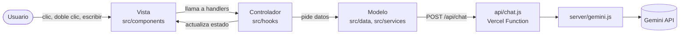

# Laboratorio Decorator

Guía visual e interactiva sobre el patrón de diseño estructural **Decorator**. Las secciones empiezan bloqueadas y **Kirby**, una mascota animada, camina o vuela hasta cada tarjeta para desbloquearla. Incluye un chat con IA (Gemini) que solo responde preguntas sobre el patrón.


**Demo:** https://m-portfolio-ten-puce.vercel.app/


## Características

- **Tarjetas bloqueadas:** siete secciones de contenido que se revelan cuando Kirby llega hasta ellas.
- **Kirby con máquina de estados:** cae, camina, corre, vuela, se transforma, duerme y se puede arrastrar y soltar con el mouse.
- **Modales de ampliación:** texto de la sección, código Java completo y diagrama UML de clases.
- **Chat con IA:** doble clic sobre Kirby y pregunta lo que quieras sobre Decorator. El asistente rechaza cualquier otro tema.
- **Backend serverless:** la clave de Gemini nunca llega al navegador; una función en Vercel actúa como intermediaria.
- **Arquitectura MVC adaptada a React:** datos, lógica y vista separados en carpetas propias.

## El patrón en 30 segundos

Decorator envuelve un objeto para añadirle responsabilidades de forma dinámica, sin modificar su clase original y sin crear una subclase por cada combinación. El ejemplo del sitio es un enemigo de videojuego que puede equipar casco, armadura y botas:

```java
Personaje enemigo = new Botas(new Armadura(new Casco(new Enemigo())));

enemigo.defensa();    // 35  (10 base + 5 casco + 20 armadura)
enemigo.velocidad();  // 15  (10 base + 5 botas)
```

Cada capa implementa la misma interfaz `Personaje`, guarda una referencia al objeto que envuelve y añade solo su propia responsabilidad.

## Cómo interactuar

| Acción | Resultado |
|---|---|
| Clic en una tarjeta bloqueada | Kirby corre o vuela hasta ella y la desbloquea |
| Botones "Ampliar sección / código / diagrama" | Abren una ventana modal (se cierra con el botón o clic afuera) |
| Doble clic sobre Kirby | Kirby va a la esquina y abre el chat |
| Doble clic sobre Kirby con el chat abierto | Cierra el chat |
| Arrastrar a Kirby y soltarlo | Cae al piso y vuelve a pasear |

## Tecnologías

| Área | Herramientas |
|---|---|
| Interfaz | React 19, JavaScript (JSX) |
| Empaquetado y desarrollo | Vite 8 |
| Estilos | CSS propio + Tailwind CSS 4 |
| Backend | Función serverless de Vercel (`api/`) |
| IA | API de Gemini (Google) |
| Calidad de código | oxlint |

## Arquitectura

La app sigue una estructura **MVC adaptada a React**. No es un patrón oficial nuevo: es la misma idea de separar responsabilidades, pensada para cómo funciona React, donde la pantalla se vuelve a dibujar sola cuando cambia el estado.

| Rol | Qué hace | Dónde vive |
|---|---|---|
| **Modelo** | Datos y acceso a servicios externos | `src/data/`, `src/services/`, `server/` |
| **Vista** | Dibuja la interfaz; solo recibe props | `src/components/`, `src/App.jsx` |
| **Controlador** | Estado, eventos y lógica (custom hooks) | `src/hooks/` |



### Estructura del proyecto

```
.
├── api/
│   └── chat.js                 # Endpoint /api/chat (solo HTTP y validación)
├── server/
│   └── gemini.js               # Cliente de Gemini, compartido por api/ y vite.config.js
├── public/                     # Archivos estáticos (favicon)
├── src/
│   ├── main.jsx                # Punto de entrada
│   ├── App.jsx                 # Compone hooks y componentes
│   ├── data/
│   │   └── sections.js         # Modelo: contenido de las 7 secciones
│   ├── services/
│   │   └── chatService.js      # Modelo: llamada a /api/chat
│   ├── hooks/                  # Controlador
│   │   ├── useChat.js          # Estado y envío de mensajes del chat
│   │   ├── useKirbyBehavior.js # Máquina de estados, movimiento y arrastre de Kirby
│   │   ├── useKirbyInteractions.js  # Coordina a Kirby con tarjetas y chat
│   │   └── useModal.js         # Qué modal está abierta
│   ├── components/             # Vista
│   │   ├── Kirby.jsx
│   │   ├── chat/               # ChatPanel
│   │   ├── layout/             # Topbar, Hero, IntroStrip, FooterNote
│   │   ├── modals/             # Modal, CodeModal, DiagramModal, SectionModal
│   │   └── sections/           # InfoCard, SectionContent
│   └── assets/                 # Imágenes y GIF de Kirby
├── vite.config.js              # Vite + endpoint /api/chat para desarrollo
└── package.json
```

## Cómo funciona el chat

1. El usuario envía una pregunta desde `ChatPanel`; el hook `useChat` la registra y llama a `chatService`.
2. `chatService` hace `POST /api/chat` con `{ "message": "..." }`.
3. El endpoint valida la petición y llama a `askGemini` (`server/gemini.js`), que consulta la API de Gemini con una instrucción de sistema que limita las respuestas al patrón Decorator.
4. La respuesta vuelve como `{ "reply": "..." }` y se muestra en el chat.

| Código | Cuándo |
|---|---|
| `200` | Respuesta correcta: `{ "reply": "..." }` |
| `400` | Mensaje vacío o cuerpo inválido |
| `405` | Método distinto de `POST` |
| `500` | Falta configurar `GEMINI_API_KEY` |
| `502` | Gemini rechazó la solicitud o no devolvió texto |

En desarrollo (`npm run dev`), un middleware de `vite.config.js` cumple el papel de `api/chat.js` y reutiliza la misma función `askGemini`, así que no hace falta Vercel para probar el chat en local.

## Empezar

### Requisitos

- Node.js `^20.19.0` o `>=22.12.0`
- Una clave de la API de Gemini ([Google AI Studio](https://aistudio.google.com/apikey))

### Instalación

```bash
git clone https://github.com/Ruzkyy/Decorator.git
cd Decorator
npm install
```

### Variables de entorno

Copia el archivo de ejemplo y coloca tu clave:

```bash
# macOS / Linux
cp .env.example .env

# Windows (PowerShell)
Copy-Item .env.example .env
```

```env
GEMINI_API_KEY=tu_clave_aqui
```

> El archivo `.env` está en `.gitignore`. No lo subas a GitHub ni lo incluyas en zips que compartas.

### Ejecutar

```bash
npm run dev
```

Abre la URL que muestra la terminal (normalmente `http://localhost:5173`).

### Scripts

| Comando | Descripción |
|---|---|
| `npm run dev` | Servidor de desarrollo, incluye `/api/chat` |
| `npm run build` | Genera la versión de producción en `dist/` |
| `npm run preview` | Sirve `dist/` localmente (no incluye `/api/chat`) |
| `npm run lint` | Revisa el código con oxlint |

## Despliegue en Vercel

Todo vive en un solo repositorio: `src/` es el frontend y `api/` son las funciones serverless. No hacen falta carpetas ni proyectos separados.

1. Sube el repositorio a GitHub.
2. En Vercel: **Add New Project** e importa el repositorio. Vercel detecta Vite (`npm run build`, salida `dist`).
3. En **Settings → Environment Variables** agrega `GEMINI_API_KEY`.
4. Despliega. Cada push a `main` vuelve a desplegar y cada rama nueva recibe una URL de prueba.

Para probar frontend y funciones juntos en local con el mismo comportamiento que Vercel, puedes usar `vercel dev` (Vercel CLI).

## Ideas para seguir

- Limitar el tamaño del mensaje y la frecuencia de uso de `/api/chat`.
- Enviar el historial de la conversación a Gemini (hoy solo se envía la última pregunta).
- Convertir la máquina de estados de Kirby al patrón State o a una tabla de transiciones.
- Agregar pruebas automáticas para los hooks.

## Autor

Hecho por **Ruzky** · [@Ruzkyy](https://github.com/Ruzkyy)
